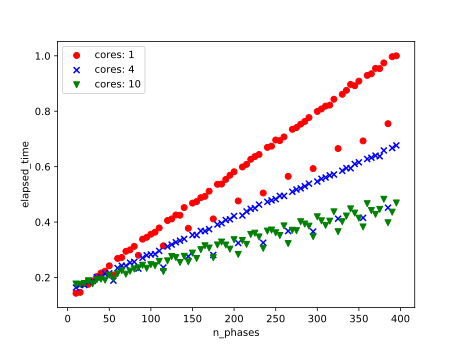
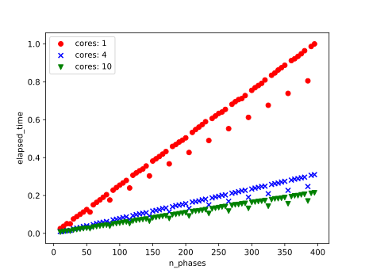
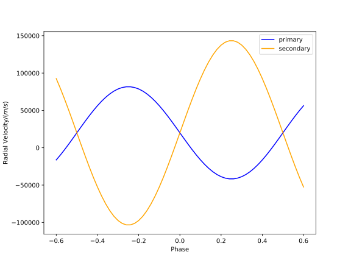
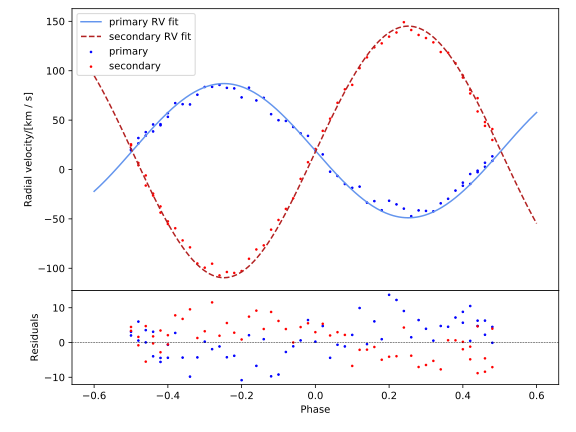
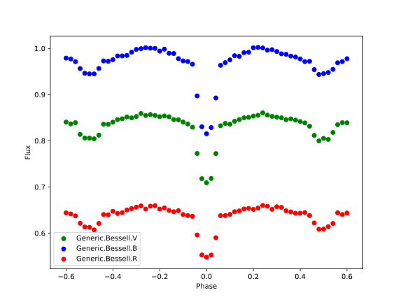
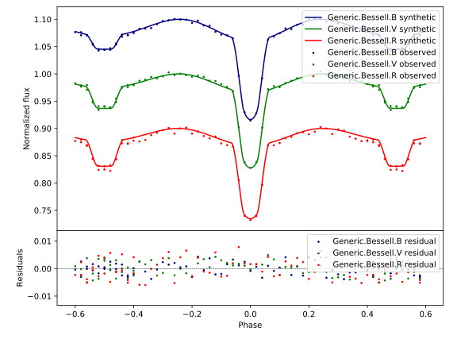
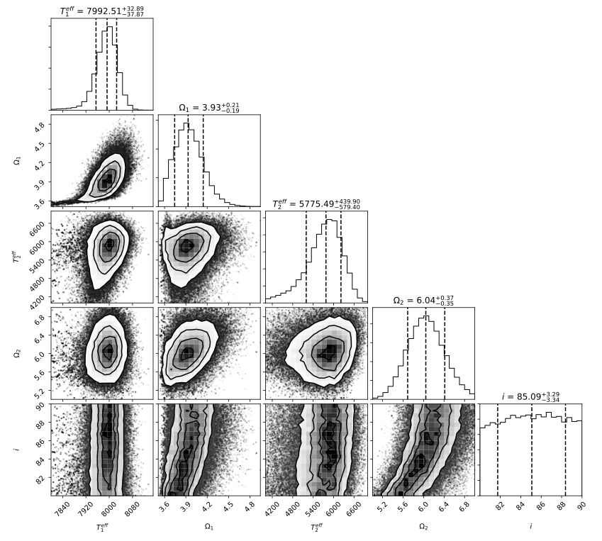

[](https://travis-ci.org/mikecokina/elisa)
[](https://github.com/Naereen/StrapDown.js)
[](https://github.com/Naereen/StrapDown.js)

Eclipsing binaries Learning Interactive System
==============================================

ELISa
-----

**ELISa** is crossplatform python package dedicated to light curves
modelling of close eclipsing binaries including surface features such as
spots and pulsation (soon). Current capabilities include:

> -   `BinarySystem:` class for modelling surfaces of detached,
>     semi-detached and over-contact binaries
> -   `Observer:` class for generating light curves (and in future
>     other observables)
> -   `Spots:` class for generating stellar spot with given longitude,
>     latitude, radius and temperature factor
> -   `Fitting methods` provide capabilities to fit radial velocities
>     curves and light curves via implementaion of
>     `non-linear least squares` method and also via
>     `Markov Chain Monte Carlo` method.

**ELISa** is currently still under development. Following features are
in progress:

> -   `SingleSystem:` class for modelling surfaces of single star light
>     curves with full implementation of spots and pulsations
> -   `Pulsations:` class for modelling low amplitude pulsations based
>     on spherical harmonics solution

We also plan to implement following features:

> -   addition of radial velocity curves to Observer class with
>     `Rossiter-McLaughlin` effect
> -   some extended `LC` and `RV` fitting using various additional
>     methods and features like classification via `neural-networks`
> -   addition of synthetic spectral line modelling

Requirements
------------

**ELISa** is a python package which requires `python v3.6+` and has
following dependencies:

    astropy==2.0.2
    cycler==0.10.0
    corner==2.0.1
    emcee==3.0.1
    jsonschema==3.2.0
    matplotlib==2.1.0
    numpy==1.16.2
    pandas==0.24.0
    py==1.4.34
    pyparsing==2.2.0
    pypex==0.1.0
    pytest==3.2.3
    python-dateutil==2.6.1
    pytz==2017.2
    scipy==1.0.0
    six==1.11.0
    tqdm==4.43.0

and potentially also **python-tk** package or equivalent for matplotlib
package to display the figures correctly.

note

:   although python distribution and package versions are specified
    precisely, that does not mean that the package will not work with
    higher versions, only that it was not tested with higher versions
    of packages. However we highly recommend to stick with python
    distribution and package versions listed above.

Install
-------

In case of `ELISa` the easiest and the safest way to install is to
create python virtual environment and install all requirements into it.
Bellow is a simple guide, how to od it. Details of installation differ
in dependence on the selected operating system.

### Ubuntu \[or similar\]

First, you have to install Python 3.6 or higher. In latest stable
version `Ubuntu 18.04` there is already preinstalled python 3.6.x. In
older versions, you will have to add repository and install it manually.
There is several quides on the internet that will help you with
installation, e.g.
[Python\_3.6](http://ubuntuhandbook.org/index.php/2017/07/install-python-3-6-1-in-ubuntu-16-04-lts/)

Install `pip3` python package manager if is not already installed on
your system, usually by execution of command:

    apt install -y python3-pip

or you can also use raw python script which provide installation via
`python`:

    curl https://bootstrap.pypa.io/get-pip.py | python3.6

Install virtual environment by command:

    pip3 install virtualenv

To create virtual environment, create directory where python virtual
environment will be stored, e.g. `/<any>/<path>/elisa/venv` and run
following command:

    virtualenv /<any>/<path>/elisa/venv --python=python3.6

After few moments you virtual environment is created and ready for use.
In terminal window, activate virtual environment:

    . /<any>/<path>/elisa/venv/bin/activate

When virtual environment is activated, install `elisa` package in dev
version. Execute following command:

    pip install git+https://github.com/mikecokina/elisa.git@dev

You will probably also need to install:

    apt install -y python3-tk

If you would like to have a look at the jupyter notebooks covering the
basic usage of this package, you should install jupyterlab inside the
previously created virtual environment:

    pip3 install jupyterlab

followed by installation of ipython kernel:

    python3 -m pip install ipykernel

Now you should be able to launch jupyter notebooks and run the tutorials
stored in &lt;elisa\_dir&gt;/jupyter\_tutorials/.

### Windows

To install python in windows, download `python 3.6.x` installation
package from official python web site. Installation package will create
all necessary dependencies except of virtual environment package.
Install virtual environment by execution of following command in command
line:

    pip3 install virtualenv

Make sure a proper version of python and pip is used. When done, create
directory where virtual environment will be stored and run:

    virtualenv /<any>/<path>/elisa --python<path>/<to>/python3.6/python.exe

It is common to specify full path to `python.exe` file under Windows,
otherwise It might not work.

Now, when virtual environment is prepared, run:

    . /<any>/<path>/elisa/Scripts/activate

And finally install `ELISa`:

    pip install elisa

How to build API docs
=====================

Use virtual environment created in previous steps and add following
dependencies:

    Sphinx==2.2.0
    sphinx-rtd-theme==0.4.3

Change directory to cloned
[docs](https://github.com/mikecokina/elisa/tree/master/docs) and use
following command:

    sphinx-build -W -b html -c .\source -d .\build\doctrees .\source\ .\build\

Minimal configuration
---------------------

`ELISa` requires minimal configuration before the first run provided by
the config file. Initially, it is necessary to download
[Atmospheres](https://github.com/mikecokina/elisa/tree/dev/atmosphere)
models and
[Limb-Darkening](https://github.com/mikecokina/elisa/tree/dev/limbdarkening)
tables.

### Default tables location

By default, the Elisa will search for atmosphere and limb darkening
tables in:

> -   atmospheres: \$HOME/.elisa/atmosphere/
> -   limb darkening: \$HOME/.elisa/limb\_darkening/

therefore, atmosphere and limb darkening tables stored at those
locations will be used by elisa by default.

### Custom tables location

Models can be stored on your machine in directory of your choosing as
well. Lets say you want ot use `Castelli-Kurucz 2004` models stored in
directory `/home/user/castelli_kurucz/ck04` and limb darkening models in
directory `/home/user/ld/`. You have to create configuration `ini` file
where model and directories will be specified. Now assume that name of
our configuration file is `elisa_config.ini` located in path
`/home/user/.elisa/`. Then content of your configuration file should at
least look like this following example:

    [support]
    ld_tables = /home/user/ld
    castelli_kurucz_04_atm_tables = /home/user/castelli_kurucz/ck04
    atlas = ck04

This configuration file is used for adjusting Full content of
configuration file with description might be found here,
[Elisa-Configuration-File](https://github.com/mikecokina/elisa/blob/master/src/elisa/conf/elisa_conf_docs.ini)

warning

:   atmospheric models and limb darkening tables for this package are
    stored in industry standard ''.csv'' files. Therefore, their native
    format as usually provided on web sites is not suitable for Elisa
    and require conversion to standard format. Models have been altered
    to form required for Elisa.

Now, you have to tell ELISa, where to find configuration file. In
environment you are using setup environment variable ELISA\_CONFIG to
full path to config file. In UNIX like operation systems it is done by
following command:

    export ELISA_CONFIG=/home/user/.elisa/elisa_config.ini

There is plenty ways how to setup environment variable which vary on
operation system and also on tool (IDE) that you have in use. On linux,
as an example, you can copy the previous command to \#HOME/.bashrc
(depends on terminal type). Optionally, you can use `config.ini` file
located in `ELISa_folder/src/elisa/conf/` without any need for setting
an enviromental variable.

Now you are all setup and ready to code.

Usage
-----

For in depth tutorials, see directory `elisa/jupyter_tutorials`

Available passbands
-------------------

    bolometric
    Generic.Bessell.U
    Generic.Bessell.B
    Generic.Bessell.V
    Generic.Bessell.R
    Generic.Bessell.I
    SLOAN.SDSS.u
    SLOAN.SDSS.g
    SLOAN.SDSS.r
    SLOAN.SDSS.i
    SLOAN.SDSS.z
    Generic.Stromgren.u
    Generic.Stromgren.v
    Generic.Stromgren.b
    Generic.Stromgren.y
    Kepler
    GaiaDR2

Multiprocessing
---------------

To speedup computation of light curves, paralellization of computations
has been implemented. Computation of light curve points is separated to
smaller batches and each batch is evaluated on separated CPU core.
Paralellization necessarily brings some overhead to process and in some
cases might cause even slower behavior of application. It is important
to choose wisely when use it espeically in case of circular synchronous
orbits which consist of spot-free components where multiprocessing is
usually not as effective.

Down below are shown some result of multiprocessor approach for
different binary system types. Absolute time necessary for calculation
of the light curve is highly dependent on the type of the system and
hardaware. Therefore we have normalized the time axis according to
maximum value in our datasets.


> width
>
> :   70%
>
> alt
>
> :   detached.circ.sync.svg
>
> align
>
> :   center
>
> Paralellization benchmark for `detached circular synchronous` star
> system.



> width
>
> :   70%
>
> alt
>
> :   detached.circ.async.svg
>
> align
>
> :   center
>
> Paralellization benchmark for `detached circular asynchronous` star
> system.



> width
>
> :   70%
>
> alt
>
> :   detached.ecc.sync.svg
>
> align
>
> :   center
>
> Paralellization benchmark for `eccentric synchronous` star system.

note

:   outliers in charts are caused by curve symetrization process

Binary Stars Radial Curves Fitting
----------------------------------

ELISa is capable to fit radial velocity curves to observed radial
velocities. In current version of ELISa, the radial velocity curves are
calculated from radial velocities of centre of mass of primary and
secondary component. An example of synthetic radial velocity curve is
shown below.



> width
>
> :   70%
>
> alt
>
> :   rv\_example.svg
>
> align
>
> :   center
>
This radial velocity curve was obtained on system with following
relevant parameters:

    primary mass: 2.0 [Solar mass]
    secondary mass: 1.0 [Solar mass]
    inclination: 85 [degree]
    argument of periastron: 0.0 [degree]
    eccentricity: 0.0 [-]
    period: 4.5 [day]
    gamma: 20000.0 [m/s]

Each fitted parameter has an input form as follows:

    <param>: {
        'value': <float>,
        'fixed': <bool>,
        'min': <float>,
        'max': <float>,
        'constraint': <str> // mutualy inclusive with fixed: True
    }

and require all params from the following list if you would like to try
absolute parameters fitting:

> -   `mass` - mass of primary/secondary component (in Solar masses)
> -   `eccentricity` - eccentricity of binary system, (0, 1)
> -   `inclination` - inclination of binary system in degrees
> -   `argument_of_periastron` - argument of periastron in degrees
> -   `gamma` - radial velocity of system center of mass in m/s
> -   `period` - period of binary system (in days), usually fixed
>     parameters
> -   `primary_minimum_time` - numeric time of primary minimum (ny time
>     units); used when exact period is unknown and fitting is required

or otherwise, in "community approach", you can use instead of `mass` and
`inclination` parameters:

> -   `asini` - in Solar radii
> -   `mass_ratio` - mass ratio (M\_2/M\_1), also known as q

There are already specified global minimal and maximal values for
parameters, but user is highly encouraged to adjust parameter boundaries
which might work better for the particular case.

Parameter set to be fixed will not be fitted and its value will stay
fixed during the fitting procedure. User can also setup constraint for
any parameter, e.g.:

    'semi_major_axis': {
        'value': 16.515,
        'constraint': '16.515 / sin(radians(system@inclination))'
    },

It is allowed to put bounds (constraints) only on parameter using other
free parameters, otherwise the parameter should stay fixed. For example,
it makes no sense to set bound like this:

    {
         ...,
         "primary": {
             "t_eff": {
                 'value': 5000.0,
                 'fixed': True
             },
             ...
         },
         "secondary": {
             "t_eff": {
                 'value': 10000.0,
                 'constraint': '{primary@t_eff * 0.5}'
             },
             ...
         }
     }

because you're already aware of value `primary@t_eff`.

Elisa currently implements two fitting approaches, first is based on
non-linear least squares method and second is based on
Markov Chain Monte Carlo (MCMC) methd.

Reading data output of MCMC requires an experience with MCMC since
output is not simple dictionary but a descriptive set of parameters
progress during evaluation of method.

Demonstrated result of fitting of radial velocities might seen like
following



> width
>
> :   70%
>
> alt
>
> :   rv\_fit.svg
>
> align
>
> :   center
>


> width
>
> :   95%
>
> alt
>
> :   mcmc\_rv\_corner.svg
>
> align
>
> :   center
>
An example scripts can be found in
[example\_scripts](https://github.com/mikecokina/elisa/tree/master/scripts/analytics)

Binary Stars Radial Curves Fitting - No Ephemeris
-------------------------------------------------

In case we do not have enough information / measurements and we are not
able determine ephemeris with desired accuracy, analytics modules of
elisa are capable to handle such situation and gives you tools to fit
period and primary minimum time as unknown parameters. In such case, xs
values has to be supplied in form:

    {
        "primary": [jd0, jd1, ..., jdn],
        "secondary": [jd0, jd1, ..., jdn],
    }

Based on primiary minimum time and period adjusted in fitting proces, JD
times are transformed to phases within process itself.

warning

:   make sure you have reasonable boundaries set for
    primary\_minimum\_time and period

Corner plot of mcmc result for such approach is in figure bellow


> width
>
> :   95%
>
> alt
>
> :   mcmc\_rv\_corner\_noperiod.svg
>
> align
>
> :   center
>
An example scripts can be found in
[example\_scripts](https://github.com/mikecokina/elisa/tree/master/scripts/analytics)

Binary Stars Light Curves Fitting
---------------------------------

Package elisa currently implements two approaches that provides very
basic capability to fit light curves to observed photometric data. First
method is standard approach which use non-linear least squares method
algorithm and second approach uses Markov Chain Monte Carlo (MCMC)
method.

Following chapter is supposed to give you brief information about
capabilities provided by elisa. Lets assume that we have a given light
curve like shown below generated on parameters:

    {
        "system": {
            'mass_ratio': 0.5,
            'semi_major_axis': 16.54321389,
            'inclination': 85.0,
            'eccentricity': 0.0,
            'period': 4.5
        },
        "primary": {
            't_eff': 8000.0,
            'surface_potential': 4.0,
            'beta': 0.32,
            'albedo': 0.6,
        },
        "secondary": {
            't_eff': 8000.0,
            'surface_potential': 4.0,
            'beta': 0.32,
            'albedo': 0.6,
        }
    }



> width
>
> :   70%
>
> alt
>
> :   lc\_example.svg
>
> align
>
> :   center
>
It is up to the user what methods choose to use (mcmc or
least\_squares). In both cases, fitting requires provide morphology
estimation. In case of over-contact morphology, fitting module keeps
surface potential of both binary components constrained to the same
value.

warning

:   Non-linear least squares method used in such complex problem as
    fitting light curves of eclipsing binaries, might be insuficient in
    case of initial parametres being too far from real values and also
    too broad fitting boundaries.

First, you should solve radial velocities if available and fix
parametres in light curve fitting. Since we were able to obtain some
basic information about our system, we should fix or efficiently
truncate boundaries for following parameters:

    "system": {
        ...,
        "asini": 16.515,
        "mass_ratio": "0.5",
        "eccentricity": "0.0",
        "argument_of_periastron": 0.0
    }

We can also estimate surface temperature of primary component via
formula implemented in elisa package.

``` {.sourceCode .python}
from elisa.analytics import bvi
b_v = bvi.pogsons_formula(lc['Generic.Bessell.B'][55], lc['Generic.Bessell.V'][55])
bvi.elisa_bv_temperature(b_v)
```

This approach give us value \~ 8307K.

note

:   index 55 is used because we know that such index will give as flux
    on photometric phase $\Phi=0.5$, where we eliminte impact of
    secondary component to result of primary component temperature.

note

:   we recommend you to set boundaries for temperature obtained from bvi
    module at least in range +/-500K.

warning

:   Use this feature only in case when you are sure about curves offsets
    to each other.

Visualization of fit is



> width
>
> :   70%
>
> alt
>
> :   lc\_fit.svg
>
> align
>
> :   center
>
`Elisa` also provides lightcurve fitting method based on
Markov Chain Monte Carlo. Read data output requires the same level of
knowledge as in case of radial velocities fitting.

Corner plot of mcmc result for such approach is in figure bellow



> width
>
> :   95%
>
> alt
>
> :   mcmc\_lc\_corner.svg
>
> align
>
> :   center
>
All example scripts can be found in
[example\_scripts](https://github.com/mikecokina/elisa/tree/master/scripts/analytics)
